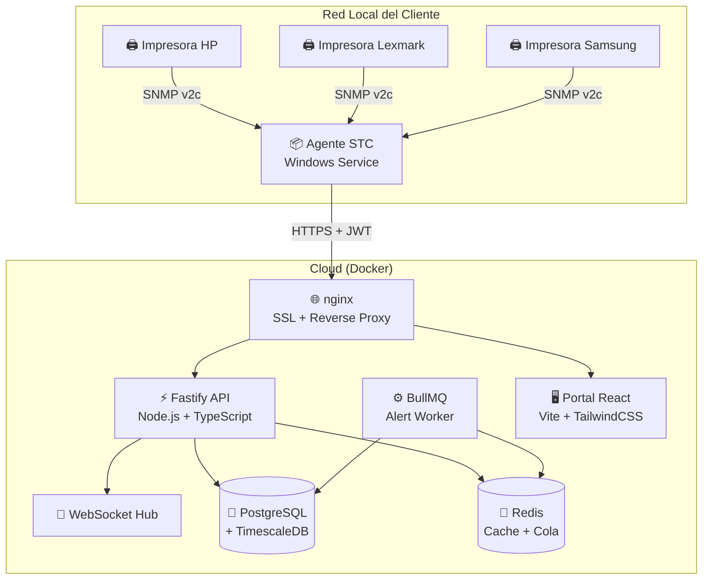

# 🖨️ STC Cloud

**Sistema de Toma de Contadores Multimarca en la Nube**

> Plataforma completa para monitoreo remoto de impresoras via SNMP. Recolecta contadores de páginas, niveles de toner y estado operativo de impresoras HP, Lexmark, Samsung, Ricoh, Brother y Xerox.

---

## 📋 Descripción

STC Cloud es un sistema empresarial que automatiza la lectura de contadores de impresoras multimarca. Consiste en:

- **Agente Windows** que escanea la red local via SNMP y envía datos a la nube
- **API Backend** que recibe, almacena y procesa los datos en series temporales
- **Portal Web** para visualización, reportes y gestión remota de agentes

### Características principales

| Funcionalidad | Detalle |
|---|---|
| 🔍 Escaneo SNMP multimarca | HP, Lexmark, Samsung, Ricoh, Brother, Xerox |
| 📊 Series temporales | PostgreSQL + TimescaleDB con compresión automática |
| 🔐 Seguridad | JWT con refresh tokens, rate limiting, AES-256-GCM |
| 📈 Portal web | Dashboard, reportes, exportación CSV, alertas en tiempo real |
| 🖥️ Agente Windows | Servicio de fondo, cola offline SQLite, reconexión automática |
| 🐳 Docker ready | Despliegue en un comando con SSL automático (Let's Encrypt) |

---

## 🏗️ Arquitectura



---

## 🛠️ Stack Tecnológico

| Componente | Tecnología |
|---|---|
| **Backend** | Node.js 20 + Fastify 4 + TypeScript |
| **Base de datos** | PostgreSQL 16 + TimescaleDB |
| **Cache / Cola** | Redis 7 + BullMQ |
| **Frontend** | React 19 + Vite + TailwindCSS 4 + Recharts |
| **Agente** | Node.js + net-snmp + better-sqlite3 |
| **Monitor UI** | .NET 10 WinForms |
| **Instalador** | Inno Setup + NSSM |
| **Infraestructura** | Docker Compose + nginx + Let's Encrypt |

---

## 📂 Estructura del Monorepo

```
stc-cloud/
├── cloud/                 # Backend API
│   ├── portal/            # Frontend React (Vite)
│   ├── src/
│   │   ├── api/           # Servidor Fastify + rutas
│   │   ├── db/            # Knex migrations + seeds
│   │   ├── services/      # Lógica de negocio (AgentService)
│   │   ├── jobs/          # Workers de alertas (BullMQ)
│   │   ├── ws/            # WebSocket hub
│   │   └── tests/         # E2E + load tests
│   ├── docker/            # Dockerfiles originales
│   ├── Dockerfile         # Build API
│   └── tsconfig.json
├── agent/                 # Agente SNMP Windows
│   ├── src/
│   │   ├── core/          # Main loop, config AES-256
│   │   ├── snmp/          # Scanner + OID maps
│   │   ├── sync/          # Cola SQLite + uploader
│   │   └── tests/         # Unit tests (26 tests)
│   └── build/             # Script de empaquetado .exe
├── monitor-ui/            # Tray app Windows (.NET WinForms)
├── installer/             # Inno Setup installer
├── shared/                # Tipos TypeScript + cripto compartida
├── docs/                  # Documentación técnica
├── docker-compose.yml     # Desarrollo local (postgres + redis)
├── docker-compose.prod.yml # Producción completa
├── nginx.conf             # Reverse proxy + SSL
├── deploy.sh              # Script de despliegue
└── .env.production.example # Template de variables
```

---

## 🚀 Inicio Rápido (Desarrollo)

### Prerrequisitos

- Node.js 20+
- Docker + Docker Compose v2
- .NET SDK 10 (solo para Monitor UI)

### 1. Clonar y configurar

```bash
git clone https://github.com/tu-org/stc-cloud.git
cd stc-cloud
cp .env.production.example .env
# Editar .env con valores de desarrollo (ver el archivo para referencia)
```

### 2. Levantar infraestructura

```bash
docker compose up -d  # PostgreSQL + Redis
```

### 3. Instalar y migrar

```bash
npm install
cd cloud && npm install && npx knex migrate:latest --knexfile src/db/knexfile.ts && npm run seed
cd portal && npm install
```

### 4. Iniciar

```bash
# Terminal 1: Backend
cd cloud && npm run dev

# Terminal 2: Portal
cd cloud/portal && npm run dev
```

- **Backend**: http://localhost:3000
- **Portal**: http://localhost:5173

> 📖 Para instrucciones detalladas de pruebas, ver [GUIA_PRUEBAS.md](GUIA_PRUEBAS.md)

---

## 🐳 Despliegue en Producción

### Prerrequisitos

- Servidor Linux con Docker + Docker Compose
- Dominio con DNS apuntando al servidor
- Puertos 80 y 443 abiertos

### 1. Clonar en el servidor

```bash
git clone https://github.com/tu-org/stc-cloud.git
cd stc-cloud
```

### 2. Configurar variables

```bash
cp .env.production.example .env.production
nano .env.production  # Completar TODOS los valores
```

### 3. Actualizar dominio en nginx

Editar `nginx.conf` y reemplazar `stc-cloud.tu-dominio.com` por tu dominio real.

### 4. Desplegar

```bash
chmod +x deploy.sh
./deploy.sh
```

El script automáticamente:
- Valida la configuración
- Genera certificado SSL con Let's Encrypt
- Levanta todos los servicios (API, Portal, PostgreSQL, Redis, nginx)
- Ejecuta migraciones de base de datos

### Comandos útiles post-deploy

```bash
# Ver logs en tiempo real
docker compose -f docker-compose.prod.yml logs -f

# Estado de los servicios
docker compose -f docker-compose.prod.yml ps

# Reiniciar un servicio
docker compose -f docker-compose.prod.yml restart api

# Detener todo
docker compose -f docker-compose.prod.yml down
```

---

## 🧪 Tests

```bash
# Unit tests del agente (sin servidor)
cd agent && npm test
# → 26 tests: scanner SNMP + cola SQLite

# E2E tests (requiere backend corriendo)
cd cloud && npm test
# → 18 tests: auth, heartbeat, sync, revocación

# Load test
cd cloud && npm run test:load -- --agents 20 --duration 60

# Simulador SNMP (sin impresora física)
cd agent && npm run snmp:sim -- --brand hp
```

---

## 📊 API Endpoints

### Públicos
| Método | Ruta | Descripción |
|--------|------|-------------|
| `GET` | `/health` | Health check |
| `POST` | `/api/v1/portal/login` | Login del portal |
| `POST` | `/api/v1/agents/activate` | Activar agente con key |
| `POST` | `/api/v1/agents/refresh` | Renovar JWT del agente |

### Agente (requiere JWT de agente)
| Método | Ruta | Descripción |
|--------|------|-------------|
| `POST` | `/api/v1/agents/:id/heartbeat` | Heartbeat + recibir config |
| `POST` | `/api/v1/devices/sync` | Enviar lecturas (batch ≤500) |
| `POST` | `/api/v1/devices/register` | Registrar nuevas impresoras |
| `GET` | `/api/v1/agents/:id/commands` | Obtener comandos pendientes |

### Portal (requiere JWT de portal)
| Método | Ruta | Descripción |
|--------|------|-------------|
| `GET` | `/api/v1/dashboard` | Stats del dashboard |
| `GET` | `/api/v1/clients` | Lista de clientes |
| `GET` | `/api/v1/agents` | Lista de agentes |
| `GET` | `/api/v1/devices/:id/readings` | Serie temporal de contadores |
| `GET` | `/api/v1/alerts` | Alertas activas |
| `POST` | `/api/v1/agents/:id/revoke` | Revocar agente |

---

## 🗺️ Roadmap

| Prioridad | Mejora |
|-----------|--------|
| 🔴 Alta | Integración con HP SDS API |
| 🔴 Alta | Exportación automática a ERP (Webhook) |
| 🟡 Media | Soporte SNMPv3 para entornos de alta seguridad |
| 🟡 Media | Expansión de diccionario de OIDs (Canon/Xerox) |

---

## 📄 Documentación

- [SECURITY_AUDIT.md](SECURITY_AUDIT.md) — **Informe de Auditoría de Seguridad (Lectura Obligatoria para IT)**
- [docs/security/](docs/security/) — Historial de auditorías internas (Frontend y Agente)
- [CONTRIBUTING.md](CONTRIBUTING.md) — Guía de estándares de codificación y contribución

---

## 📝 Licencia

Uso privado. Todos los derechos reservados.
