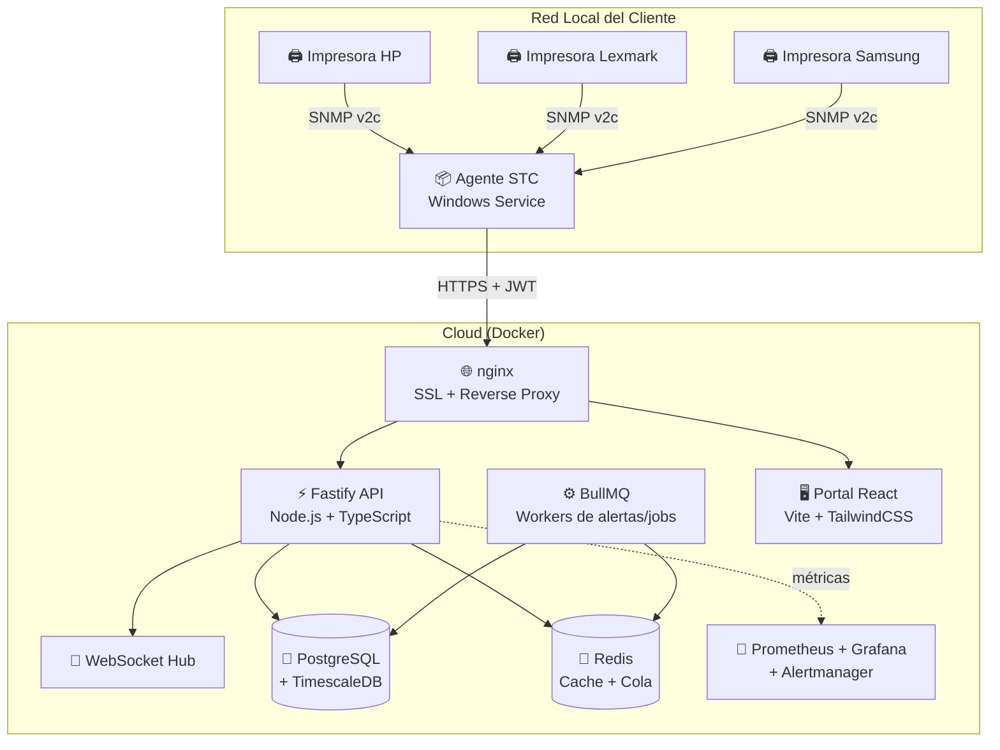

# 🖨️ STC Cloud

**Sistema de Toma de Contadores Multimarca en la Nube**

> Plataforma completa para monitoreo remoto de impresoras vía SNMP. Recolecta contadores de páginas, niveles de tóner y estado operativo de impresoras HP, Lexmark, Samsung, Ricoh, Brother y Xerox.

---

## 📋 Descripción

STC Cloud es un sistema empresarial que automatiza la lectura de contadores de impresoras multimarca. Consiste en:

- **Agente Windows (DCA)** que escanea la red local vía SNMP y envía datos a la nube
- **API Backend** que recibe, valida y almacena los datos en series temporales
- **Portal Web** para visualización, reportes y gestión remota de agentes
- **Stack de observabilidad** (Prometheus + Grafana + Alertmanager) y backups automáticos en producción

### Características principales

| Funcionalidad | Detalle |
|---|---|
| 🔍 Escaneo SNMP multimarca | HP, Lexmark, Samsung, Ricoh, Brother, Xerox |
| 📊 Series temporales | PostgreSQL + TimescaleDB con compresión automática |
| 🔐 Seguridad | JWT con refresh tokens, rate limiting, AES-256-GCM, RBAC agente/portal |
| 📈 Portal web | Dashboard, reportes, exportación CSV, alertas en tiempo real |
| 🖥️ Agente Windows | Servicio de fondo, cola offline SQLite, reconexión automática |
| 🔌 API pública para ERP | Solo lectura + webhooks salientes por API key (ver [OpenAPI](docs/api/openapi.yaml)) |
| 📡 Observabilidad | Prometheus + Grafana + Alertmanager + backups automáticos (producción) |
| ✅ CI en cada PR | Lint/typecheck/build, guardas de arquitectura, tests de integración reales |
| 🐳 Docker ready | Despliegue en un comando con SSL automático (Let's Encrypt) |

---

## 🏗️ Arquitectura


```mermaid
graph TB
    subgraph "Red Local del Cliente"
        P1[🖨️ Impresora HP]
        P2[🖨️ Impresora Lexmark]
        P3[🖨️ Impresora Samsung]
        A[📦 Agente STC<br/>Windows Service]
    end

    subgraph "Cloud (Docker)"
        NG[🌐 nginx<br/>SSL + Reverse Proxy]
        API[⚡ Fastify API<br/>Node.js + TypeScript]
        WS[🔌 WebSocket Hub]
        PG[(🐘 PostgreSQL<br/>+ TimescaleDB)]
        RD[(🔴 Redis<br/>Cache + Cola)]
        BQ[⚙️ BullMQ<br/>Workers de alertas/jobs]
        FE[🖥️ Portal React<br/>Vite + TailwindCSS]
        OBS[📡 Prometheus + Grafana<br/>+ Alertmanager]
    end

    P1 & P2 & P3 -->|SNMP v2c| A
    A -->|HTTPS + JWT| NG
    NG --> API
    NG --> FE
    API --> PG
    API --> RD
    API --> WS
    BQ --> PG
    BQ --> RD
    API -.métricas.-> OBS
```

---

## 🛠️ Stack Tecnológico

| Componente | Tecnología |
|---|---|
| **Backend** | Node.js 20 + Fastify 5 + TypeScript |
| **Base de datos** | PostgreSQL 16 + TimescaleDB |
| **Cache / Cola** | Redis 7 + BullMQ |
| **Frontend** | React 19 + Vite 6 + TailwindCSS 4 + Recharts |
| **Agente** | Node.js + net-snmp + better-sqlite3, empaquetado como SEA (esbuild) |
| **Monitor UI** | .NET 9 WinForms (tray app local) |
| **Instalador** | Inno Setup + NSSM |
| **Infraestructura** | Docker Compose + nginx + Let's Encrypt |
| **Observabilidad (prod)** | Prometheus + Grafana + Alertmanager + backups automáticos |
| **CI** | GitHub Actions (lint, typecheck, build, guardas de arquitectura, tests de integración) |

---

## 📂 Estructura del Monorepo

```
stc-cloud/
├── cloud/                    # Backend API
│   ├── portal/               # Frontend React (Vite) — package.json/lockfile propios
│   ├── src/
│   │   ├── api/               # Servidor Fastify, rutas y middlewares
│   │   ├── modules/            # Dominios (clients, devices, alerts, incidents, public-api, ...)
│   │   ├── db/                 # Knex migrations + seeds
│   │   ├── services/           # Lógica de negocio transversal
│   │   ├── jobs/                # Workers de alertas/reportes (BullMQ)
│   │   ├── ws/                  # WebSocket hub
│   │   └── tests/              # 65 archivos de test (integración E2E contra Postgres+Redis reales)
│   ├── scripts/               # Guardas de arquitectura (check:sizes/guards/routes/coverage)
│   └── Dockerfile
├── agent/                    # Agente SNMP Windows (DCA)
│   ├── src/
│   │   ├── core/               # Main loop, ConfigManager (AES-256-GCM + HWID), ConsoleEngine
│   │   ├── capture/             # Motor de captura por marca/modelo (drivers, OIDs)
│   │   ├── snmp/                # Transporte SNMP
│   │   ├── sync/                # Cola SQLite + uploader
│   │   └── tests/              # 19 archivos de test (unitarios, sin servidor)
│   └── build-sea.js           # Empaquetado real a binario (esbuild), usado por el instalador
├── monitor-ui/               # Tray app Windows (.NET WinForms)
├── installer/                # Inno Setup installer + firma del binario
├── shared/                   # Tipos TS y utilidades de cripto — sin package.json propio,
│                              #   no integrado a los builds actuales de cloud/agent (código huérfano)
├── docs/                     # Documentación técnica (ver docs/README.md)
├── grafana/ · prometheus/ · alertmanager/  # Config del stack de observabilidad de producción
├── .github/workflows/ci.yml  # CI: portal, guardas de arquitectura, API, agente
├── docker-compose.yml         # Infra de desarrollo (postgres + redis + api + portal en contenedor)
├── docker-compose.prod.yml    # Producción completa (+ nginx, certbot, backups, observabilidad)
├── nginx.conf                 # Reverse proxy + SSL
├── deploy.sh                  # Script de despliegue
└── .env.production.example    # Template de variables
```

> `bridge/console-engine.ts` es código huérfano de una feature anterior (ver `agent/src/core/ConsoleEngine.ts`, que la reemplazó); no se referencia desde ningún build actual.

---

## 🚀 Inicio Rápido (Desarrollo)

### Prerrequisitos

- Node.js 20+
- Docker + Docker Compose v2
- .NET SDK 9 (solo para Monitor UI)

### 1. Clonar y configurar

```bash
git clone https://github.com/tu-org/stc-cloud.git
cd stc-cloud
cp .env.production.example .env
# Editar .env con valores de desarrollo (ver el archivo para referencia)
```

### 2. Levantar infraestructura

`docker-compose.yml` define postgres, redis, api y portal — para desarrollo con hot-reload conviene levantar solo la infraestructura y correr api/portal en el host (paso 4):

```bash
docker compose up -d postgres redis
```

### 3. Instalar y migrar

```bash
npm install
cd cloud && npm install && npx knex migrate:latest --knexfile src/db/knexfile.ts && npm run seed
cd portal && npm install
```

### 4. Iniciar

```bash
# Terminal 1: Backend
cd cloud && npm run dev

# Terminal 2: Portal
cd cloud/portal && npm run dev
```

- **Backend**: http://localhost:3000
- **Portal**: http://localhost:5173

---

## 🐳 Despliegue en Producción

### Prerrequisitos

- Servidor Linux con Docker + Docker Compose
- Dominio con DNS apuntando al servidor
- Puertos 80 y 443 abiertos

### 1. Clonar en el servidor

```bash
git clone https://github.com/tu-org/stc-cloud.git
cd stc-cloud
```

### 2. Configurar variables

```bash
cp .env.production.example .env.production
nano .env.production  # Completar TODOS los valores
```

### 3. Actualizar dominio en nginx

Editar `nginx.conf` y reemplazar `stc-cloud.tu-dominio.com` por tu dominio real.

### 4. Desplegar

```bash
chmod +x deploy.sh
./deploy.sh
```

El script automáticamente:
- Valida la configuración
- Genera certificado SSL con Let's Encrypt
- Levanta todos los servicios (API, Portal, PostgreSQL, Redis, nginx, Prometheus, Grafana, Alertmanager, backups)
- Ejecuta migraciones de base de datos

### Comandos útiles post-deploy

```bash
# Ver logs en tiempo real
docker compose -f docker-compose.prod.yml logs -f

# Estado de los servicios
docker compose -f docker-compose.prod.yml ps

# Reiniciar un servicio
docker compose -f docker-compose.prod.yml restart api

# Detener todo
docker compose -f docker-compose.prod.yml down
```

Ver [docs/internos/DEPLOY_CLOUD.md](docs/internos/DEPLOY_CLOUD.md) para el procedimiento detallado.

---

## ✅ CI / Calidad

Cada push y PR a `main` corre en GitHub Actions ([`.github/workflows/ci.yml`](.github/workflows/ci.yml)):

| Job | Qué valida |
|---|---|
| **Portal** | ESLint + TypeScript + validación de íconos + build |
| **Arquitectura** | Guardas contra `docs/dev/ARCHITECTURE_GUIDE.md`: límites de tamaño de archivo/función (`check:sizes`), reglas de dependencias entre capas (`check:guards`), autenticación declarada en toda ruta (`check:routes`) |
| **API** | Build + tests de integración reales contra Postgres/Redis levantados como servicios del job, + cobertura mínima por capa (`check:coverage`) |
| **Agente** | Build + suite de tests + empaquetado real con esbuild (el mismo artefacto que firma el instalador) |

---

## 🧪 Tests

```bash
# Unit tests del agente (sin servidor)
cd agent && npm test
# → 19 archivos de test: scanner SNMP, cola SQLite, captura por marca, etc.

# Tests de integración (requiere backend + Postgres + Redis reales)
cd cloud && npm test
# → 65 archivos de test: auth, RBAC, heartbeat, sync, alertas, incidentes, API pública, etc.

# Load test
cd cloud && npm run test:load -- --agents 20 --duration 60

# Simulador SNMP (sin impresora física)
cd agent && npm run snmp:sim -- --brand hp
```

---

## 📊 API

Hay dos superficies de API separadas:

- **`/api/v1/...`** — la que usan el portal (cookie de sesión JWT) y el agente (JWT de agente). Principales rutas:

  | Método | Ruta | Descripción |
  |--------|------|-------------|
  | `GET` | `/health` | Health check |
  | `POST` | `/api/v1/portal/login` | Login del portal |
  | `POST` | `/api/v1/agents/activate` | Activar agente con key |
  | `POST` | `/api/v1/agents/refresh` | Renovar JWT del agente |
  | `POST` | `/api/v1/agents/:id/heartbeat` | Heartbeat + recibir config *(JWT agente)* |
  | `POST` | `/api/v1/devices/sync` | Enviar lecturas, batch ≤500 *(JWT agente)* |
  | `GET` | `/api/v1/dashboard` | Stats del dashboard *(JWT portal)* |
  | `GET` | `/api/v1/devices/:id/readings` | Serie temporal de contadores *(JWT portal)* |
  | `POST` | `/api/v1/agents/:id/revoke` | Revocar agente *(JWT portal)* |

  El resto de los módulos (clientes, incidentes, insumos, costos, reportes programados, plantillas, 2FA, IP ranges, SFTP, etc.) siguen el mismo esquema; el catálogo completo de rutas lo genera `npm run check:routes:catalog -w cloud`.

- **API pública de solo lectura (+ webhooks)** — pensada para que un ERP externo consulte flota, cierres y alertas de un cliente sin hacer polling, autenticada por API key. Spec completa en [`docs/api/openapi.yaml`](docs/api/openapi.yaml).

---

## 🗺️ Roadmap

| Prioridad | Mejora |
|-----------|--------|
| 🔴 Alta | Integración con HP SDS API |
| 🟡 Media | Soporte SNMPv3 para entornos de alta seguridad |
| 🟡 Media | Expansión de diccionario de OIDs (Canon/Xerox) |

> La exportación a ERP por webhook (antes en este roadmap) ya está implementada — ver [`docs/api/openapi.yaml`](docs/api/openapi.yaml).

---

## 📄 Documentación

Ver [docs/README.md](docs/README.md) para el índice completo (documentos para presentar a clientes/auditores, guías de arquitectura, auditorías de seguridad, etc.). Accesos directos:

- [docs/cliente/STC_Auditoria_Sistemas_IT_v1.7.html](docs/cliente/STC_Auditoria_Sistemas_IT_v1.7.html) — Especificaciones técnicas de seguridad para Auditoría IT
- [docs/dev/ARCHITECTURE_GUIDE.md](docs/dev/ARCHITECTURE_GUIDE.md) — Principios y guardas de arquitectura del código
- [docs/dev/CODE_MAP.md](docs/dev/CODE_MAP.md) — Mapa detallado del código fuente
- [docs/api/openapi.yaml](docs/api/openapi.yaml) — Spec de la API pública para integración ERP
- [SECURITY_AUDIT.md](SECURITY_AUDIT.md) — Informe de Auditoría de Seguridad (Resumen Ejecutivo)
- [CONTRIBUTING.md](CONTRIBUTING.md) — Guía de estándares de codificación y contribución

---

## 📝 Licencia

Uso privado. Todos los derechos reservados.
