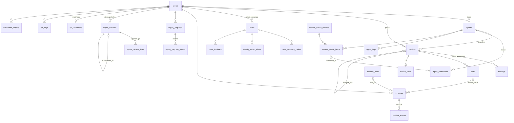

# Modelo de datos de STC Cloud

Documento de referencia del esquema PostgreSQL de STC Cloud: qué tablas hay, qué guarda
cada una, cómo se relacionan y por qué están diseñadas así. Es la explicación que acompaña
al DER (Diagrama Entidad-Relación) que genera DBeaver sobre el schema `public`.

**Verificado contra la base real el 2026-09-12** (75 migraciones aplicadas, la última
`20260911130000_agent_monitor_intervals`). El esquema se construye exclusivamente con las
migraciones de Knex en `cloud/src/db/migrations/`; la API las corre al arrancar. Si este
documento y una migración posterior se contradicen, manda la migración.

Audiencia: desarrolladores del equipo y personal de IT/DBA que revise la base con DBeaver
u otro cliente SQL.

---

## 1. Cifras y cómo reproducir el DER

| Qué | Cantidad |
| :--- | :--- |
| Tablas | 35 (33 de negocio + 2 internas de Knex) |
| Vistas | 3 (2 agregados continuos de TimescaleDB + 1 vista SQL) |
| Foreign keys | 63 |
| Constraints `CHECK` | 44 |
| Índices además de las PK | 64 (varios parciales y por expresión) |
| Hypertables (TimescaleDB) | 1 (`readings`) |
| Triggers | 1 (`agents_client_id_sync`) |

**Para ver el DER en DBeaver:** conectarse a la base, desplegar `stc_cloud → Schemas → public`,
clic derecho sobre `public` → *View Diagram*. El layout automático apila todo en una
columna; conviene arrastrar `clients` y `users` a los costados y `devices` al centro, y
guardar el diagrama (*File → Save*) para no rehacerlo. Se exporta a PNG/SVG desde el
menú contextual del diagrama.

**Cómo leer el diagrama:** cada caja es una tabla; la fila en negrita es la clave primaria.
Los iconos indican el tipo de la columna (`A-Z` texto, `123` número, reloj fecha/hora,
`{ }` JSON, tilde booleano). Cada línea es una foreign key declarada en la base: si dos
tablas se relacionan sólo por convención del código, no hay línea. Las cajas con icono de
ojo son vistas, no tablas.

---

## 2. Vista general

El modelo tiene dos "hubs" hacia los que convergen casi todas las líneas:

- **`clients`** — el tenant. Casi toda tabla de negocio tiene `client_id`: es la columna
  por la que se aísla la información entre clientes.
- **`users`** — recibe todas las FK de auditoría de acciones humanas: `created_by`,
  `closed_by`, `assigned_to`, `resolved_by`, `updated_by`, etc.

La cadena operativa principal es **cliente → agente → dispositivo → lectura**, y de los
dispositivos cuelgan alertas, incidentes, pedidos de insumos y líneas de cierre de
facturación.



Tablas que **no** aparecen en el diagrama por no tener FK: `device_models` (catálogo,
se cruza por texto, ver §5.3), `agent_releases`, `system_settings` (singleton),
`audit_logs` (FK sólo a `clients`), `email_log`, `message_templates`, `custom_field_defs`,
`device_merge_candidates`, y las tres vistas.

---

## 3. Convenciones transversales

Estas reglas se repiten en todo el esquema y explican la mayoría de lo que se ve en el DER.

**Claves primarias UUID.** Todas las tablas de negocio usan `id uuid DEFAULT gen_random_uuid()`.
Las excepciones son herencia del esquema inicial: `alerts.id` y `agent_logs.id` son
`integer` con secuencia. Además hay dos numeradores legibles para humanos, separados de la
PK: `incidents.number` (secuencia) y `remote_action_batches.number` (columna identity).

**Fechas siempre `timestamptz`.** No hay ninguna columna `timestamp` sin zona horaria.
`created_at` con default `CURRENT_TIMESTAMP`; `updated_at` lo mantiene la aplicación
(no hay trigger de `updated_at`).

**Multi-tenant por `client_id`.** Las tablas que pertenecen a un cliente llevan
`client_id` con FK a `clients`. Tres tablas de configuración admiten `client_id NULL`
con significado "valor global, aplica a todos los clientes": `custom_field_defs`,
`incident_rules` y `message_templates`. Como Postgres no considera iguales dos `NULL` en
un índice único, la unicidad "una regla por cliente y clase" se garantiza con un índice
sobre `COALESCE(client_id, '00000000-…')` (ver §5.5, §5.8).

**Política de borrado según el tipo de relación.**

| `ON DELETE` | Cuándo se usa | Ejemplos |
| :--- | :--- | :--- |
| `CASCADE` | El hijo no tiene sentido sin el padre (composición). | `devices.agent_id`, `readings.device_id`, `incident_events.incident_id`, todo lo que cuelga de `clients`. |
| `SET NULL` | Referencia de auditoría o vínculo opcional; el registro debe sobrevivir al borrado del referido. | Todas las columnas `*_by` hacia `users`, `incidents.device_id`, `supply_requests.device_id`. |
| `RESTRICT` | Prohibido borrar el padre si tiene hijos. | Único caso: `report_closures.client_id` — un cliente con cierres de facturación no se puede borrar. |

**Enumeraciones como `CHECK`, no como tipo `ENUM`.** Los estados (`status`, `severity`,
`origin`, `kind`, `role`…) son `text`/`varchar` con un `CHECK (col IN (...))`. Agregar un
valor es un `ALTER TABLE … DROP/ADD CONSTRAINT` en una migración, sin bloquear la tabla
como pasa con `ALTER TYPE … ADD VALUE` dentro de una transacción.

**Checks de coherencia.** Además de los enumerados, hay checks que atan un estado a su
timestamp para que la base no admita registros contradictorios: `incidents_close_coherent_check`
(`status = 'closed'` ⇔ `closed_at IS NOT NULL`), `supply_requests_close_coherent_check`,
`devices_merge_coherent_check`, `devices_registration_coherent_check`,
`devices_decommission_coherent_check`.

**Índices parciales para "lo abierto".** Los listados operativos consultan casi siempre
lo pendiente, no el histórico. Por eso abundan los índices con `WHERE status <> 'closed'`,
`WHERE resolved = false`, `WHERE resolved_at IS NULL`. Son chicos y cubren exactamente la
consulta caliente. Varios además son **únicos**, y hacen de regla de negocio: "no puede
haber dos alertas abiertas del mismo tipo para el mismo equipo" (`alerts_device_type_open_uniq`),
"un solo incidente automático abierto por equipo y clase" (`incidents_open_device_class_uniq`),
"un pedido automático abierto por equipo e insumo" (`supply_requests_open_uniq`),
"un cierre vigente por cliente y período" (`report_closures_client_period_open_uniq`).

**JSONB para lo que no se filtra por columna.** `metadata`, `payload`, `params`,
`recipients`, `custom_data`, `supplies_details`, `snmp_credentials`, `business_hours`,
`discovery_state`. `devices.custom_data` es el único con índice GIN
(`jsonb_path_ops`), porque se filtra desde el portal.

**Snapshots desnormalizados a propósito.** `incidents`, `supply_requests` y
`report_closure_lines` guardan `device_serial` / `device_label` / `device_model` /
`agent_name` además del `device_id`. Es intencional: un ticket o una línea de facturación
tiene que conservar el nombre que tenía el equipo en ese momento, aunque después se
renombre, se fusione o se borre (`ON DELETE SET NULL` deja el `device_id` en NULL pero
el texto queda).

---

## 4. Dominios

| Dominio | Tablas |
| :--- | :--- |
| 4.1 Tenancy, usuarios y acceso | `clients`, `users`, `user_recovery_codes`, `activity_saved_views`, `user_feedback`, `api_keys`, `api_webhooks`, `audit_logs`, `system_settings` |
| 4.2 Agentes | `agents`, `agent_commands`, `agent_logs`, `agent_releases`, `remote_action_batches`, `remote_action_items` |
| 4.3 Dispositivos | `devices`, `device_models`, `device_costs`, `device_merge_candidates`, `custom_field_defs` |
| 4.4 Lecturas (series temporales) | `readings`, `readings_daily_agg`, `readings_monthly_agg`, `device_usage_30d` |
| 4.5 Alertas e incidentes | `alerts`, `incidents`, `incident_alerts`, `incident_events`, `incident_rules` |
| 4.6 Insumos | `supply_requests`, `supply_request_events` |
| 4.7 Cierres de facturación | `report_closures`, `report_closure_lines` |
| 4.8 Reportes y notificaciones | `scheduled_reports`, `message_templates`, `email_log` |
| 4.9 Infraestructura | `knex_migrations`, `knex_migrations_lock` |

---

## 5. Tablas por dominio

### 5.1 Tenancy, usuarios y acceso

#### `clients`
El tenant. Además de datos de contacto, concentra la **configuración por cliente**:
`device_approval_required` (los equipos nuevos quedan `pending` hasta que alguien los
apruebe), `supply_requests_enabled` + `supply_request_threshold_pct` (pedidos automáticos
de insumos, umbral 1–99 %), `notification_email` / `notification_webhook_url` /
`notification_events` (qué eventos se notifican), `sftp_destination` (jsonb, entrega de
reportes) y `last_alert_digest_sent_at` (control del resumen diario de alertas).

#### `users`
Usuarios del portal. `role` ∈ {`admin`, `operator`, `client_viewer`}. `client_id` es
nullable: `admin` y `operator` son globales; un `client_viewer` **debe** tener cliente
(`users_client_viewer_requires_client_check`). Segundo factor: `totp_secret`,
`totp_enabled`, `totp_required`. `username` único.

#### `user_recovery_codes`
Códigos de recuperación de 2FA, uno por fila, guardados como `code_hash`. `used_at` marca
el consumo; índice parcial sobre los no usados.

#### `activity_saved_views`
Filtros guardados de la pantalla de actividad, por usuario (`filters` jsonb).

#### `user_feedback`
Reportes de bug / mejora enviados desde el portal. `type` ∈ {`bug`, `enhancement`},
`status` ∈ {`open`, `in_progress`, `closed`}.

#### `api_keys`
Claves de la API pública, por cliente. Se guarda **sólo el hash** (`key_hash`, único) y un
`key_prefix` de 12 caracteres para identificarla en la UI. `revoked_at` / `expires_at`
para invalidarla sin borrarla.

#### `api_webhooks`
Un webhook por cliente (`client_id` es único). `events` jsonb con la lista suscripta,
`secret` para firmar el payload.

#### `audit_logs`
Bitácora de acciones humanas: `user_id`, `action`, `target_id`, `metadata`, `ip_address`.
`target_id` es **texto sin FK**, porque apunta a cualquier tabla (patrón polimórfico);
`user_id` tampoco tiene FK para que el log sobreviva al borrado del usuario. Sólo
`client_id` tiene FK (`SET NULL`). Indexada por `(action, created_at)`, `(client_id, created_at)`
y `target_id`.

#### `system_settings`
Configuración global de una sola fila: `id boolean PRIMARY KEY DEFAULT true` con
`CHECK (id)`. Como el único valor posible es `true` y es PK, no puede existir una segunda
fila. Guarda umbrales de offline (agente 1–1440 min, equipo 1–1440 min), SMTP
(`smtp_password_encrypted` cifrada por la aplicación) y umbrales globales de insumos.

### 5.2 Agentes

#### `agents`
El servicio instalado en la red del cliente. Ciclo de vida: nace con `activation_key`
(única) y `activation_expires_at`; al activarse queda ligado a un `hardware_id` y recibe
`jwt_secret` + `refresh_token_hash`. `status` default `pending`. `client_id` es nullable
porque el agente puede existir antes de asignarse a un cliente.

Configuración operativa que baja al agente: `ip_ranges`, `snmp_community`,
`snmp_credentials` (+ `snmp_credentials_rev` para detectar cambios), `scan_interval_minutes`,
`monitor_intervals`, `business_hours`, `toner_*_threshold`, `remote_ews_enabled`, `channel`
(`stable`/… para actualizaciones). Telemetría del host: `version`, `host_name`, `host_os`,
`host_ip`, `uptime`, `runtime`, `last_seen`, `discovery_state`.

**Trigger `agents_client_id_sync`:** si se cambia el `client_id` de un agente, la función
`sync_devices_client_id()` actualiza el `client_id` de todos sus `devices`. Es la única
lógica en la base; existe para que `devices.client_id` (NOT NULL, usado en todos los
filtros) nunca quede desincronizado del agente.

#### `agent_commands`
Cola de comandos hacia un agente: `type`, `payload` jsonb, `status` (default `pending`),
`result`, `sent_at`, `executed_at`. `created_by` es texto, no FK (puede ser un job del
sistema). Índice `(agent_id, status)` para el polling.

#### `agent_logs`
Logs que sube el agente. PK `integer` (herencia). Índice `(agent_id, timestamp)`.

#### `agent_releases`
Catálogo de versiones publicadas del agente para actualización remota: `version` +
`channel` únicos, `kind`, `url`, `sha256` (verificación del binario). Sin FK: es un
catálogo global.

#### `remote_action_batches` y `remote_action_items`
Acciones remotas masivas (`RESCAN`, `FORCE_SCAN`, `RESTART`, `FORCE_UPDATE`,
`RESTART_PRINTER`). El batch tiene `scheduled_at`, `status` y un `number` legible
(identity). Cada item apunta a un agente y opcionalmente a un equipo (`device_id`,
`device_ip`), y cuando se despacha queda enlazado al `agent_commands.id` generado
(`command_id`). Índice único `(batch_id, agent_id, COALESCE(device_id, zero-uuid))`
evita duplicar destinos dentro de un batch.

### 5.3 Dispositivos

#### `devices`
La impresora. Es la tabla más ancha (74 columnas) y la más consultada. Se puede leer en
capas:

- **Identidad y red:** `serial_number`, `mac` (tipo `macaddr`), `ip_address` (tipo `inet`),
  `hostname`, `brand`, `model`, `sku`, `firmware`, `agent_id`, `client_id` (NOT NULL).
- **Nombre y ubicación en tres columnas:** `*_reported` (lo que dice la impresora),
  `*_override` (lo que cargó un operador) y la columna efectiva (`name`, `location`,
  `asset_number`) que la aplicación resuelve como `override ?? reported`. Lo mismo para
  `duty_cycle_monthly_override`.
- **Último estado conocido (snapshot):** `total_pages`/`mono_pages`/`color_pages`
  (`bigint`), `toner_*` (0–100), `last_seen`, y **20 columnas `cartridge_*`**: para cada
  color (black/cyan/magenta/yellow) el código, serial, capacidad, impreso y estimado del
  cartucho. Más `supplies_details` jsonb para insumos que no encajan en las 4 columnas
  (tambores, fusor, kits). Ver §6 sobre por qué está desnormalizado.
- **Estados de gestión, cada uno con su auditoría:**
  - `registration_state` ∈ {`pending`, `registered`, `ignored`} + `registered_at/by`,
    `ignored_at/by`, `ignore_reason`.
  - `monitor_state` ∈ {`full`, `supplies_only`, `reports_only`, `disabled`} +
    `monitor_state_changed_at/by/reason`.
  - `decommissioned_at/by`, `decommission_reason`.
  - `merged_into` (FK a sí misma) + `merged_at/by`: fusión de duplicados; el equipo
    absorbido queda como registro histórico apuntando al sobreviviente.
  - `supply_origin` ∈ {`genuine`, `non_genuine`} + `supply_origin_at`.
- **Campos personalizados:** `custom_data` jsonb con índice GIN; las definiciones viven
  en `custom_field_defs`.

Índices relevantes: `(client_id, upper(trim(serial_number)))` **único parcial**, que
excluye seriales basura (vacíos, cortos, iguales a la IP, caracteres repetidos, `unknown`…)
y equipos ya fusionados; `(agent_id, ip_address)`; `(client_id, mac)`;
`(client_id, upper(trim(asset_tag)))`; parciales por `pending`, por `monitor_state <> 'full'`
y por `merged_into`.

#### `device_models`
Catálogo de modelos (datasheet): `brand`, `model_key` (modelo normalizado en minúsculas),
`display_name`, `duty_cycle_monthly`, `recommended_volume_monthly`, `is_color`. Único por
`(lower(brand), model_key)`. **No tiene FK desde `devices`**: el cruce es por texto
(`devices.brand` + normalización de `devices.model`), porque el modelo llega tal cual lo
reporta la impresora y no siempre existe en el catálogo. Ver §6.

#### `device_costs`
Costos por equipo, relación 1:1 (`device_id` es la PK): `capital_cost`, `quarterly_rental`,
`mono_page_cost`, `color_page_cost`, `service_contract_cost` (+ `_years` 1–20), `currency`
(default `ARS`). Todos `numeric`, con check de no negativos.

#### `device_merge_candidates`
Sospechas de equipos duplicados detectadas por un job: `client_id`, `serial_key`,
`device_ids` (array de uuid), `reason`. Un candidato abierto por `(client_id, serial_key)`
(índice único parcial `WHERE resolved_at IS NULL`).

#### `custom_field_defs`
Definiciones de campos personalizados: `key`, `label`, `type` ∈ {`text`, `number`, `date`,
`select`, `boolean`}, `options` (para select), `position`, `archived_at`. `client_id NULL`
= definición global. Único por `(scope, lower(key))` entre las no archivadas.

### 5.4 Lecturas (series temporales)

#### `readings`
Cada lectura SNMP de un equipo: `time`, `device_id`, contadores (`total/mono/color_pages`),
`toner_*`, `offline`, `supplies_details` jsonb, `reading_id` (uuid que manda el agente para
idempotencia: reenviar la misma lectura no la duplica, índice único `(reading_id, time)`).

Es una **hypertable de TimescaleDB** particionada por `time`, y por eso **no tiene clave
primaria**: TimescaleDB exige que toda restricción única incluya la columna de partición,
y una PK `id` sola no la incluye. La unicidad real la da `readings_reading_id_time_unique`.
Políticas activas:

| Política | Valor |
| :--- | :--- |
| Compresión | chunks con más de 7 días, ordenados por `time DESC` |
| Retención | se borran lecturas con más de 2 años |

Índices: `(device_id, time DESC)` y `(time DESC)`. Al 2026-09-12 hay ~27 000 lecturas desde
2026-05-28. Nota: `pg_stat_user_tables` muestra 0 filas para `readings` porque los datos
viven en los chunks internos de TimescaleDB, no en la tabla madre.

#### `readings_daily_agg` y `readings_monthly_agg`
**Agregados continuos** de TimescaleDB (por eso DBeaver los muestra como vistas con un
`UNION ALL` contra `_timescaledb_internal._materialized_hypertable_N`). Por equipo y día /
mes: el **último** valor de cada contador (`last(total_pages, time)`), no la suma, porque
los contadores son acumulativos; más `reading_count`. Se refrescan solos: el diario cubre
los últimos 3 días hasta 1 h atrás, el mensual los últimos 3 meses.

#### `device_usage_30d`
Vista SQL común sobre `readings_daily_agg`: páginas impresas en los últimos 30 días por
equipo, calculadas como diferencia entre días consecutivos (`lag()`), descartando deltas
negativos (reseteo de contador).

### 5.5 Alertas e incidentes

#### `alerts`
Alerta automática sobre un equipo **o** sobre un agente (`alerts_device_or_agent_check`
exige al menos uno). `type`, `severity` ∈ {`warning`, `critical`}, `value`, `message`,
`alert_class`, `alert_reason`, `responder`, `origin` (default `cloud`; también puede
generarla el agente). Ciclo: `acknowledged`/`ack_by`/`ack_at` y `resolved`/`resolved_at`.
PK `integer` (herencia).

Reglas por índice único parcial: una sola alerta **abierta** por `(device_id, type)` y por
`(agent_id, type)`. Así el job que evalúa lecturas no genera duplicados.

#### `incidents`
Ticket de trabajo. `number` correlativo legible (único), `external_id` para el sistema de
tickets del cliente, `class`, `title`, `description`, `severity`, `status` ∈ {`open`,
`in_progress`, `on_hold`, `closed`}, `origin` ∈ {`auto`, `manual`}. SLA: `opened_at`,
`first_response_at`, `sla_due_at`. Cierre: `closed_at/by`, `close_reason`,
`reopened_count`. Personas: `assigned_to`, `created_by`. Referencias con `SET NULL`:
`device_id`, `agent_id`, `rule_id` (la regla que lo generó). Snapshot `device_serial`,
`device_label`.

Índice único parcial: un incidente **automático abierto** por `(device_id, class)`.

#### `incident_alerts`
Tabla intermedia N:M entre incidentes y alertas, con PK compuesta `(incident_id, alert_id)`
y auditoría `linked_at`, `linked_by`. Un incidente agrupa varias alertas; una alerta puede
haber pasado por más de un incidente.

#### `incident_events`
Historial del incidente: `kind` ∈ {`comment`, `status_change`, `assign`, `link_alert`,
`unlink_alert`, `external_id`, `reopen`, `sla_breached`}, `body`, `metadata`, `user_id`.
Índice `(incident_id, created_at)`.

#### `incident_rules`
Reglas de apertura automática por clase de alerta: `class`, `enabled`, `min_severity`,
`delay_minutes` (esperar antes de abrir), `sla_hours`, `auto_close_on_alerts_resolved`.
`client_id NULL` = regla global; única por `(scope, class)`.

### 5.6 Insumos

#### `supply_requests`
Pedido de insumo (tóner, tambor, etc.) por equipo: `supply_key` (identificador estable del
insumo dentro del equipo), `supply_kind`, `supply_color`, `description`, `sku`,
`level_pct`, `remaining_days`, `status` ∈ {`pending`, `reviewed`, `processed`, `completed`,
`ignored`, `cancelled`}, `origin` ∈ {`auto`, `manual`}, `notes`. Check de coherencia:
los tres estados terminales ⇔ `closed_at IS NOT NULL`. Snapshot `device_serial`,
`device_label`. Índice único parcial: un pedido automático abierto por `(device_id, supply_key)`.

#### `supply_request_events`
Historial del pedido, mismo patrón que `incident_events`: `kind` ∈ {`status_change`,
`comment`, `auto_complete`}.

### 5.7 Cierres de facturación

#### `report_closures`
Cierre mensual de contadores por cliente: `period` (`date`, primer día del mes), `status`
(default `closed`), totales agregados (`total_pages/mono/color/other`, `device_count`,
`anomalies_count`), `closed_at/by`. Reapertura: `reopened_at/by`, `reopen_reason`, y
`superseded_by` (FK a sí misma) apuntando al cierre que lo reemplazó, de modo que la
cadena de versiones queda trazable. Un solo cierre vigente por `(client_id, period)`.
Es la única tabla con `ON DELETE RESTRICT` hacia `clients`: los cierres son registros
contables y no se pierden por borrar un cliente.

#### `report_closure_lines`
Una línea por equipo dentro del cierre: primera y última lectura del período
(`first_*`, `last_*`), deltas calculados (`delta_total/mono/color/other`),
`delta_estimated` (cuando hubo huecos), `source` (de dónde salió el dato),
`had_counter_reset`. Snapshot completo del equipo y agente (`device_serial`,
`device_model`, `device_brand`, `agent_name`) porque el cierre tiene que poder
reimprimirse igual dentro de un año.

### 5.8 Reportes y notificaciones

#### `scheduled_reports`
Reportes programados: `report_type` ∈ {`usage`, `non_contactable`, `consumable_levels`,
`asset_list`, `alert_history`, `billing_closure`, `audit_export`}, `params` jsonb,
`format` ∈ {`csv`, `xlsx`}, `schedule_freq` ∈ {`none`, `daily`, `weekdays`, `weekly`,
`monthly`} con `schedule_dow` (0–6), `schedule_dom` (1–28, para que exista en todo mes)
y `schedule_hour` (0–23), `recipients` jsonb, `enabled`, `next_run_at`, `last_run_*`.
Índice parcial por `next_run_at` sobre los habilitados: es lo que consulta el scheduler.

#### `message_templates`
Plantillas de asunto/cuerpo por evento (`alert.created`, `incident.created`,
`supply_request.created`, `supply_request.completed`, `report.closed`, `alert.digest`).
`client_id NULL` = plantilla global; única por `(scope, event)`.

#### `email_log`
Registro de cada email intentado: `event`, `recipient`, `subject`, `status` ∈ {`sent`,
`error`, `skipped_no_transport`, `skipped_no_recipient`}, `error`, `metadata`. Sirve para
diagnosticar "no me llegó el mail" sin acceder al servidor SMTP.

### 5.9 Infraestructura

`knex_migrations` (qué migraciones se aplicaron, en qué batch) y `knex_migrations_lock`
(candado para que dos instancias de la API no migren a la vez). Son de Knex; no tocar a mano.

---

## 6. Decisiones de diseño y su justificación

Las preguntas que suele hacer un DBA al ver el DER, con la respuesta.

**¿Por qué `devices` tiene 74 columnas y 20 de ellas son `cartridge_*`?**
Porque `devices` es un *snapshot del último estado* pensado para que el listado principal
del portal (cientos de equipos, filtrado y ordenado por cualquier columna) se resuelva con
un solo `SELECT` sin joins ni agregaciones. El histórico verdadero está en `readings`.
La alternativa normalizada (`device_supplies` con una fila por color) obligaría a un join
o a un `crosstab` en la consulta más frecuente del sistema. Los insumos que no son los 4
colores clásicos van a `supplies_details` jsonb, así la tabla no sigue creciendo por tipo
de insumo.

**¿Por qué `readings` no tiene clave primaria?**
Es una hypertable de TimescaleDB particionada por `time`. TimescaleDB no permite una PK
que no incluya la columna de partición. La idempotencia se garantiza con el índice único
`(reading_id, time)`. La migración `20260821200000_reconcile_readings_hypertable_and_reading_id`
documenta el cambio.

**¿Por qué `device_models` no tiene FK desde `devices`?**
El modelo llega como texto libre desde la impresora (`devices.model`) y el catálogo se
carga aparte y de forma incompleta. Una FK obligaría a tener el modelo catalogado antes de
registrar el equipo, o a dejar `model_id` NULL casi siempre. El cruce por
`(lower(brand), model_key)` con índice único da lo mismo en la práctica. Si en el futuro
el catálogo pasa a ser completo, agregar `devices.model_id` nullable con FK es una
migración chica.

**¿Por qué hay columnas repetidas (`device_serial`, `device_label`, `agent_name`) en
incidentes, pedidos y líneas de cierre?**
Son snapshots deliberados (ver §3). Un ticket o una línea de facturación tiene que mostrar
lo que decía el equipo en ese momento, no lo que dice hoy, y tiene que sobrevivir a que el
equipo se fusione o se borre.

**¿Por qué `audit_logs.target_id` es texto y no FK?**
Porque apunta a cualquier entidad (equipo, usuario, cliente, regla…). Una FK por tabla
posible sería una columna nullable por cada una. El patrón polimórfico es el estándar en
tablas de auditoría; el índice sobre `target_id` cubre la consulta "todo lo que pasó con X".

**¿Por qué los ids son UUID y no enteros?**
Los agentes generan identificadores offline (`reading_id`) y las entidades se referencian
en URLs públicas del portal y de la API; un UUID no es enumerable. `alerts` y `agent_logs`
quedaron con enteros del esquema inicial; cambiarlos no aporta y rompería la PK compuesta
de `incident_alerts`.

**¿Por qué los estados son `CHECK` y no `ENUM`?**
Agregar un valor a un `ENUM` de Postgres no puede hacerse dentro de la misma transacción
que lo usa y no se puede quitar un valor. Con `CHECK`, cada cambio es una migración normal
y reversible.

**¿Por qué tanto índice parcial y único?**
Los únicos parciales son *reglas de negocio* que la aplicación no puede garantizar sola
frente a dos jobs o dos réplicas de la API escribiendo a la vez: "una alerta abierta por
equipo y tipo", "un cierre vigente por período". Que lo garantice la base es más barato y
más seguro que un lock en código.

**¿Por qué `system_settings.id` es un booleano?**
Es la forma canónica de tabla-singleton en Postgres: PK booleana con `CHECK (id)` sólo
admite la fila `true`. Evita un `LIMIT 1` implícito y que alguien inserte una segunda fila.

**¿Por qué hay un trigger si el resto de la lógica está en la aplicación?**
`devices.client_id` es NOT NULL y se usa en todos los filtros de aislamiento entre
clientes. Si reasignar un agente dejara sus equipos con el cliente viejo, sería una fuga
de datos entre tenants. El trigger `agents_client_id_sync` hace esa actualización
atómica en la misma transacción, independientemente de por dónde se haga el cambio.

**Puntos abiertos conocidos** (no son errores, pero un DBA los va a señalar):

- `agent_commands.created_by` es texto, no FK a `users`, porque también lo crean jobs.
- `audit_logs.user_id` no tiene FK, por la misma razón que `target_id`.
- No hay trigger de `updated_at`; lo mantiene la aplicación en cada `UPDATE`.
- `readings.device_id` es nullable (no debería haber lecturas sin equipo; la aplicación lo
  garantiza, la base no).

---

## 7. Consultas útiles para revisar el esquema

Todas son de sólo lectura y sirven para regenerar las cifras de este documento.

```sql
-- Tablas y vistas del schema public
SELECT c.relname, c.relkind
FROM pg_class c JOIN pg_namespace n ON n.oid = c.relnamespace
WHERE n.nspname = 'public' AND c.relkind IN ('r','v','m') ORDER BY 1;

-- Foreign keys con su política de borrado (c = cascade, n = set null, r = restrict)
SELECT conrelid::regclass AS tabla, a.attname AS columna,
       confrelid::regclass AS referencia, confdeltype AS on_delete
FROM pg_constraint c
JOIN pg_attribute a ON a.attrelid = c.conrelid AND a.attnum = ANY (c.conkey)
WHERE contype = 'f' AND connamespace = 'public'::regnamespace ORDER BY 1, 2;

-- Checks (los "enums" del esquema)
SELECT conrelid::regclass, conname, pg_get_constraintdef(oid)
FROM pg_constraint WHERE contype = 'c' AND connamespace = 'public'::regnamespace ORDER BY 1;

-- Índices parciales y por expresión
SELECT tablename, indexname, indexdef FROM pg_indexes
WHERE schemaname = 'public' AND (indexdef LIKE '%WHERE%' OR indexdef LIKE '%(%(%') ORDER BY 1;

-- Estado de TimescaleDB
SELECT hypertable_name, compression_enabled FROM timescaledb_information.hypertables;
SELECT hypertable_name, proc_name, config FROM timescaledb_information.jobs
WHERE hypertable_name IS NOT NULL;

-- Migraciones aplicadas
SELECT name, batch, migration_time FROM knex_migrations ORDER BY id DESC LIMIT 5;
```

Para conectarse desde DBeaver al entorno de desarrollo: host `localhost`, puerto `5434`,
base `stc_cloud`, usuario `stc_admin` (ver `docker-compose.yml`). Conviene marcar la
conexión como *read-only* en DBeaver: un clic de más en la grilla edita datos en vivo.
